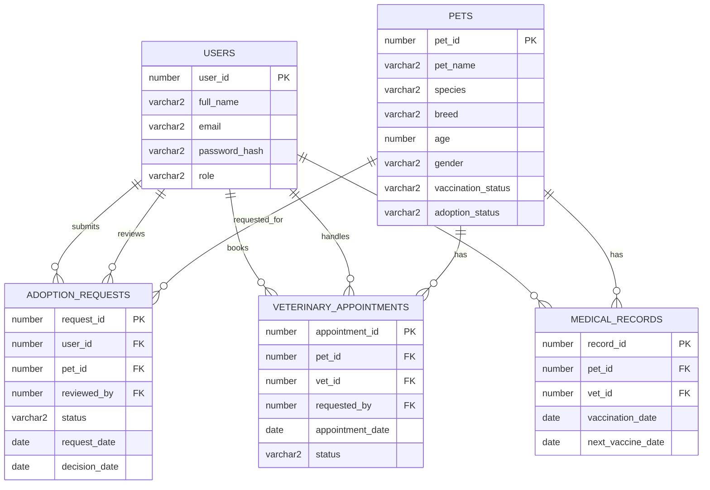

# ER Diagram

```mermaid
erDiagram
    USERS ||--o{ ADOPTION_REQUESTS : submits
    USERS ||--o{ ADOPTION_REQUESTS : reviews
    USERS ||--o{ VETERINARY_APPOINTMENTS : books
    USERS ||--o{ VETERINARY_APPOINTMENTS : handles
    USERS ||--o{ MEDICAL_RECORDS : performs

    PETS ||--o{ ADOPTION_REQUESTS : requested_for
    PETS ||--o{ VETERINARY_APPOINTMENTS : has
    PETS ||--o{ MEDICAL_RECORDS : has

    USERS {
        number user_id PK
        varchar2 full_name
        varchar2 email
        varchar2 password_hash
        varchar2 role
    }

    PETS {
        number pet_id PK
        varchar2 pet_name
        varchar2 species
        varchar2 breed
        number age
        varchar2 gender
        varchar2 vaccination_status
        varchar2 adoption_status
    }

    ADOPTION_REQUESTS {
        number request_id PK
        number user_id FK
        number pet_id FK
        number reviewed_by FK
        varchar2 status
        date request_date
        date decision_date
    }

    VETERINARY_APPOINTMENTS {
        number appointment_id PK
        number pet_id FK
        number vet_id FK
        number requested_by FK
        date appointment_date
        varchar2 status
    }

    MEDICAL_RECORDS {
        number record_id PK
        number pet_id FK
        number vet_id FK
        date vaccination_date
        date next_vaccine_date
    }
```
